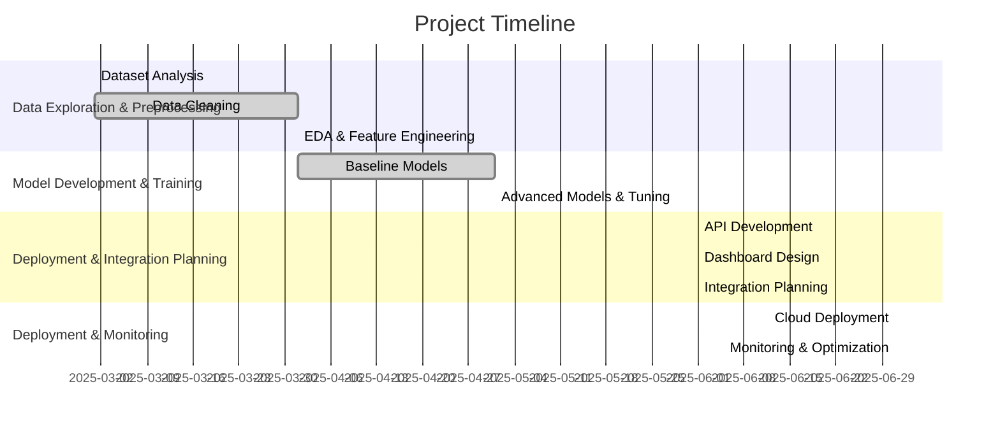
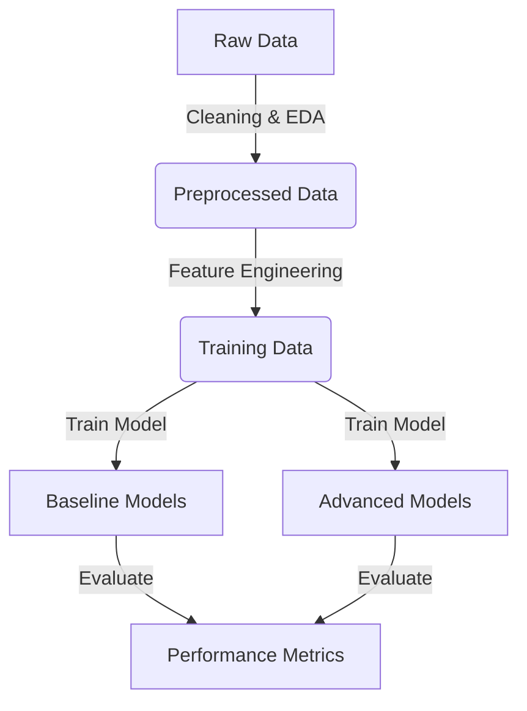
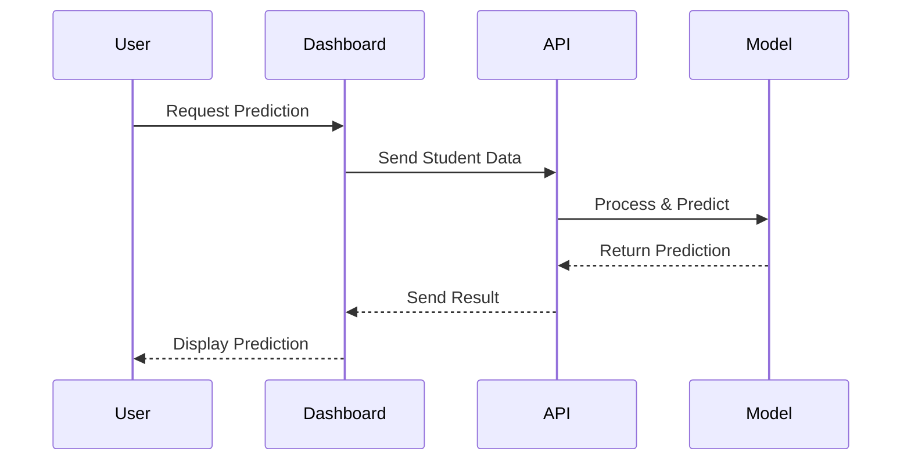
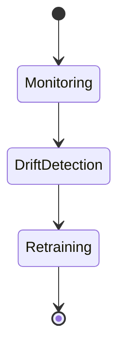

# Student Dropout Prediction System - 4-Month Implementation Roadmap

  

## Overview
**Goal:** Develop an AI-powered system to predict student dropout risks based on academic, socio-economic, and personal factors.

**Dataset:** [Predict Students' Dropout and Academic Success (UCI)](https://archive.ics.uci.edu/dataset/697/predict+students+dropout+and+academic+success)

---

## Project Timeline

---

## Month 1: Data Exploration & Preprocessing
> Quality data is the foundation of a good model.

### Tasks:
- Understand dataset (features, missing values, distributions)
- Data cleaning: handle missing values, normalize features, encode categorical variables
- Exploratory Data Analysis (EDA): identify correlations, feature importance, and class imbalance
- Define problem scope: classification approach, risk indicators, evaluation metrics

### Expected Outcomes:
- Cleaned dataset ready for model training
- Insights into key dropout indicators

---

## Month 2: Model Development & Training
> Start simple, then optimize.

### Tasks:
- Split dataset (Train/Test, handle class imbalance if needed)
- Train baseline models: Logistic Regression, Decision Trees, Random Forest
- Experiment with advanced models: XGBoost, Neural Networks
- Hyperparameter tuning & model comparison

### Expected Outcomes:
- Well-performing predictive model with optimized accuracy
- Comparative analysis of model performances

---

## Month 3: Deployment & Integration Planning
> A model is only useful if it can be accessed and interpreted.

### Tasks:
- Develop API for model inference (Flask/FastAPI)
- Design a simple dashboard for institutions (React/Django)
- Plan integration with campus systems (Databases, student records)
- Test API endpoints and model robustness

### Expected Outcomes:
- Functional API for prediction requests
- Prototype dashboard for dropout insights
- Defined strategy for campus system integration

---

## Month 4: Deployment, Monitoring & Optimization
> Models degrade over time—monitoring is key.

### Tasks:
- Deploy model on a cloud platform (Hugging Face, AWS, Google Cloud)
- Implement logging & monitoring (drift detection, retraining strategies)
- Conduct real-world testing with sample student data
- Optimize performance & finalize documentation

### Expected Outcomes:
- Deployed, accessible predictive model
- Monitoring system for model performance
- Comprehensive documentation for future scalability

---

## Final Deliverables
- Fully trained & deployed model
- API for campus system integration
- Interactive dashboard for student dropout insights
- Monitoring system for ongoing evaluation

### Next Steps:
- Expand the model using additional datasets
- Refine feature selection
- Scale integration across institutions

> Data-driven decisions can transform student success rates. Let’s build for impact!
