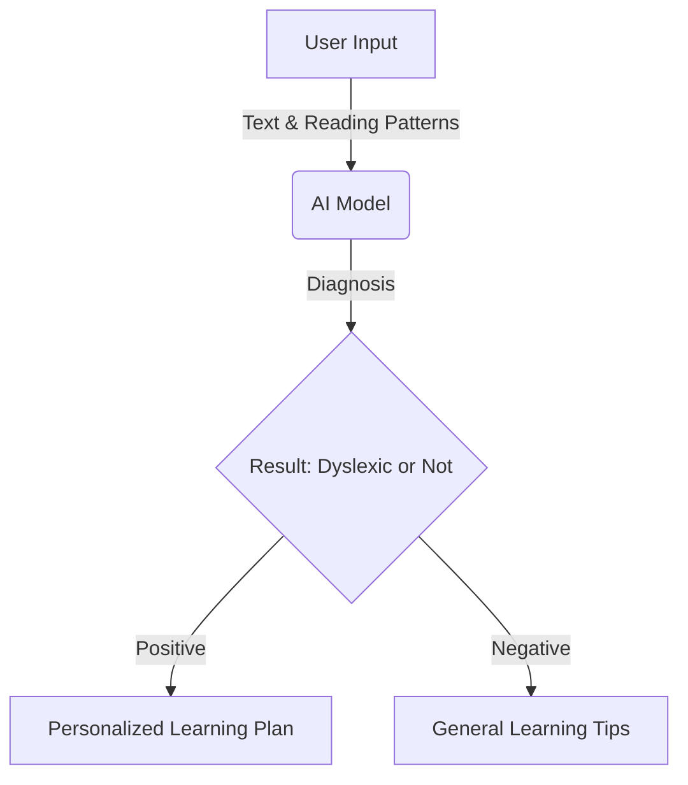
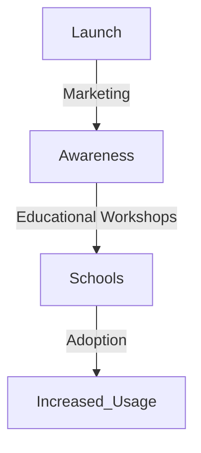

# LexiBloom Project Roadmap  

> **Empowering neurodiverse learners with AI-driven dyslexia detection and support.**  

---

## 📌 Overview  
LexiBloom is an AI-powered tool designed to identify dyslexia early and provide actionable insights for parents and teachers. This roadmap outlines our phased approach to development, testing, and deployment.  

---

## 📅 Project Timeline  

| Phase | Duration | Key Milestones |
|-------|----------|----------------|
| **Phase 1: Research & Planning** | Month 1-2 | Market research, user needs analysis, partnerships |
| **Phase 2: Data Collection & Model Training** | Month 3-5 | Dataset acquisition, model training, feedback loops |
| **Phase 3: Prototype Development** | Month 6-7 | Mobile & web app development, AI integration |
| **Phase 4: Testing & Refinement** | Month 8-9 | Pilot testing, AI & UI improvements, security considerations |
| **Phase 5: Deployment & Awareness Campaign** | Month 10-12 | Public launch, awareness campaigns, institutional adoption |
| **Phase 6: Continuous Improvement & Expansion** | Ongoing | Model updates, feature expansion, geographic scaling |

---

## 🏗️ Phase 1: Research & Planning  
- [x] Conduct market research on dyslexia awareness in Kenya  
- [x] Engage with educators, parents, and specialists  
- [x] Define AI functionalities and scope  
- [x] Establish partnerships with schools and organizations  

---

## 📊 Phase 2: Data Collection & Model Training  
- [ ] Collect linguistic and cognitive datasets  
- [ ] Preprocess and label data for training  
- [ ] Train machine learning models for dyslexia detection  
- [ ] Develop feedback loops to refine AI accuracy  

---

## 📱 Phase 3: Prototype Development  
- [ ] Build the **LexiBloom** mobile (React Native) and web application  
- [ ] Integrate AI-based screening and recommendations  
- [ ] Design an intuitive UI for parents and teachers  
- [ ] Implement educational resources for dyslexia support  

## 🔬 Phase 4: Testing & Refinement
- [ ] Conduct pilot testing with selected schools and parents
- [ ] Gather feedback on AI accuracy and user experience
- [ ] Improve model performance and UI/UX
- [ ] Address security, privacy, and ethical concerns

## 🚀 Phase 5: Deployment & Awareness Campaign
- [ ] Launch LexiBloom to the public
- [ ] Conduct targeted dyslexia awareness campaigns
- [ ] Partner with educational institutions for large-scale use
- [ ] Set up user support and training resources

## 🔄 Phase 6: Continuous Improvement & Expansion
- [ ] Regular AI model updates based on new data
- [ ] Expand language and cultural adaptation
- [ ] Introduce additional features (speech, handwriting analysis)
- [ ] Scale to other regions facing similar dyslexia challenges

## 📝 Final Thoughts
> **"Dyslexia is not a limitation—it's a different way of thinking. LexiBloom is here to ensure that every child receives the support they deserve."**

